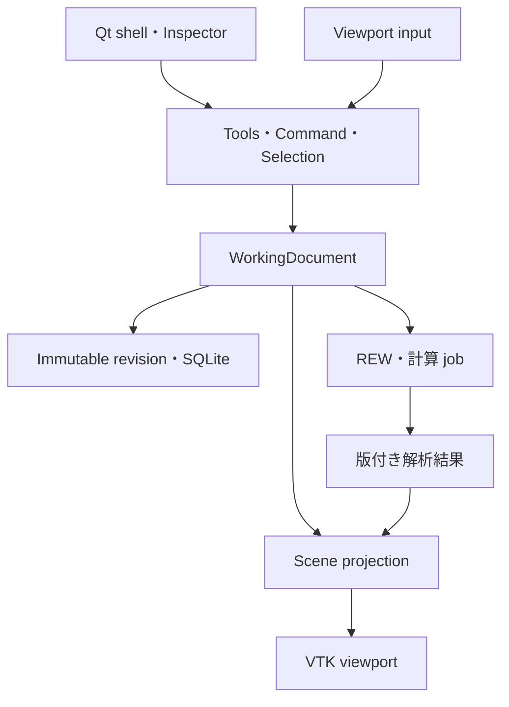

# HTDT 実装ロードマップ — CAD-first 正本

> 改訂: 2026-09-20 / N05〜N90・O10〜O80 software completion＋O90 robust optimization＋O100 system expansion＋Issue #170 StandardsProfile＋Issue #101 acoustics＋Issue #118 UI/UX overhaul反映
> 対象: Windows 11 x64・個人利用
> **今後の実装順・milestone・受入条件の正本。計画上の成果を実装済みと扱わない。**

## 0. 決定と文書の関係

HTDTの中心を、mouseで部屋・スピーカー・座席・スクリーン・家具を直接構築し、測定・予測・配置候補を同じdigital twinへ結び付けるnative applicationにする。Room/Placementでは3D CAD型viewportを主役にする一方、Measurements/Optimizeまで全てを同じdock shellへ押し込まない。旧GUI、API、DB、ファイル形式の互換性は要件にしない。言語や過去の実装量より、操作品質と将来の実装・保守効率を優先する。

PySide6/Qt Widgets＋PyVista/VTK/PyVistaQtを第一実装方針として維持する。ただし、標準widgetでCAD操作が完成すると仮定しない。N05/N20の操作・配布gateを通過してから範囲を拡大する。根拠は[OSS調査](CAD_EDITOR_OSS_RESEARCH.md)、決定は[ADR-0001](adr/0001-native-cad-editor-stack.md)。

| 文書 | 正本とする内容 |
|---|---|
| 本書 | 実装順、依存、完了条件、移行 |
| [PROJECT_PLAN](PROJECT_PLAN.md) | 製品スコープと非目標 |
| [CAD_EDITOR_SPEC](CAD_EDITOR_SPEC.md) | 編集・保存・座標・形状・非同期処理の契約 |
| [UI_DESIGN](UI_DESIGN.md) | 操作と画面の設計 |
| [CAD_EDITOR_ACCEPTANCE](CAD_EDITOR_ACCEPTANCE.md) | fixture、手順、DPI/性能・実機gate |
| [ADR-0001](adr/0001-native-cad-editor-stack.md) / [OSS調査](CAD_EDITOR_OSS_RESEARCH.md) | 技術判断 / 読んだコードと採否 |
| [IMPLEMENTATION_STATUS](IMPLEMENTATION_STATUS.md) | main、branch、報告済みPoC、未検証の区別 |
| [DATA_AND_ANALYSIS](DATA_AND_ANALYSIS.md) / [MEASUREMENT_WORKFLOW](MEASUREMENT_WORKFLOW.md) | 不変測定・比較・REW連携契約 |
| [PLACEMENT_OPTIMIZATION_ROADMAP](PLACEMENT_OPTIMIZATION_ROADMAP.md) | 予測・最適化の算法詳細。作業順は本書に従う |
| [O90_ROBUST_OPTIMIZATION](O90_ROBUST_OPTIMIZATION.md) | O90設置誤差・入力不確かさ・robust Paretoのauthority / acceptance |
| [O100_SYSTEM_EXPANSION_OPTIMIZATION](O100_SYSTEM_EXPANSION_OPTIMIZATION.md) | O100仮想speaker/channel追加・system topology/equipment/placement比較のauthority / acceptance |
| [STANDARDS_PROFILES](STANDARDS_PROFILES.md) | Issue #170 versioned standards/layout criterion、source provenance、evaluation、hard-constraint opt-in authority |
| [ACOUSTIC_SOLVER_RESEARCH_2026-09-18](ACOUSTIC_SOLVER_RESEARCH_2026-09-18.md) | Issue #101の数値手法/OSS調査、hybrid solver方針、R100〜R180の技術根拠 |
| [PLAN_REVIEW](PLAN_REVIEW.md) | 指摘・修正・検証記録 |

Issue/PRは本書を具体的な作業へ落とす追跡票とし、本書と矛盾する独立仕様にしない。仕様変更は対応する正本文書も同じPRで更新する。

旧文書のbrowser-first方針、旧v0.x実装順、PR #37内のfeature parity方針は本書で置換する。現行G00/G10/O10の実装契約と新Sceneの設計を混同しない。新Sceneへの変更はSPECと対応adapterで明示する。

## 1. 完成像と最初のrelease

中央のviewportでroom footprintを描き、頂点・壁・高さを編集し、paletteから物体を置く。gizmo、snap、寸法入力、Undo/Redoが同じ編集経路で動く。Top/Front/Side/Perspective、Scene tree、Inspectorは同じDocumentを扱う。

完成形は実測、配置制約、反射経路、予測場、多目的候補の比較へ進む。ただし、最初の**CAD foundation previewはN05〜N40＋最低限のpackage**で出せる。予測volumeや最適化完成を待たない。測定統合版はN60、最適化workspaceはモデルgateを満たしたN80として別に評価する。

## 2. 技術と境界

- Python 3.12 x64を最初の対象minorとする。無制限な3.12+の依存解決はしない。
- PySide6 / Qt Widgets、PyVista / VTK / PyVistaQt、Pydantic、SQLite、Shapely。
- NumPy、必要な計算からSciPy。FR dockはPyQtGraphをN60で評価。
- N05でWindows用の再現可能な依存lockと起動entry pointをcommitする。過去PoCの版はlockの代用にしない。
- 主GUIはnative application。自分自身へのHTTP、WebView、Node runtimeは必須にしない。
- domain/serviceはQt/VTK非依存。renderはGUI thread、長いI/O/計算は取消可能なjob。
- full CAD kernel、engine全体のfork、独自描画engineを初期に作らない。
- Issue #101の任意形状音響は、20–300 Hz wave acoustics＋中高域geometrical acousticsのhybridを基本とする。full-wave 20 Hz–20 kHzを標準経路にしない。
- solver correctnessはCPU baselineで成立させ、GPUはoptional acceleratorとする。CUDA/NVIDIAをprediction authorityへ埋め込まず、backend/device/resolutionをprovenanceへ保存する。
- 材料はgeometric用のbanded absorption/scatteringとwave用のcomplex impedance/admittanceを区別し、scalar吸音率から位相情報を無言で捏造しない。

詳細は[SPEC](CAD_EDITOR_SPEC.md)。SceneRevisionと測定Context、編集履歴と保存履歴、物理状態と表示状態を分離する。

## 3. Milestoneと依存

N番号は既存PRとの追跡用に維持する。N05を追加し、N20/N30を小さなsliceへ分ける。各行は小さなPRに分割できる。担当を自動的に増やす計画ではない。

| ID | 先行条件 | 成果 / 完了gate |
|---|---|---|
| N00 — 方針正本化 | なし | README・旧計画の矛盾を解消し、ADR・調査・受入へ到達可能。今回の文書改訂 |
| N05 — 技術の縦断試作 | N00 | GitHubのコード/lockだけから起動。F1でpick→drag→cancel/Undo→Save/reopen。standalone packageも試す。A01/A02 |
| N10 — editor shell / 保存 | N05 | QMainWindow、QtInteractor、Scene tree、Inspector、view切替、SceneRevision保存、復旧最小版。A03/A04 |
| N20a — 基本変形 | N10 | ToolController、CommandHistory、Move/Rotate、数値編集、grid/axis/angle snap。A05/A06 |
| N20b — CAD選択・snap | N20a | multi-select、vertex/edge/midpoint/alignment snap、pivot、入力競合解消。A07とDPI/性能 |
| N30a — room sketch | N20a、共通selection | 凹polygon作図・頂点挿入/削除/移動・高さ・寸法・bounds自動更新。A08 |
| N30b — wall / opening | N30a、N20b | 安定wall ID、開口、壁厚表示、壁変更とconstraint参照のtransaction。A09 |
| N40 — theater objects | N20b、N30b | speaker/seat/screen/furniture/AV機器/測定点、palette、duplicate、hide/lock、寸法。A10 |
| N50 — 制約の空間表示 | N40 | G10 adapter、allowed/exclusion、通路/離隔、壁選択、拒否理由overlay。A11 |
| N60 — 実測workspace | N40、保存契約 | REW読取/取込、SceneRevisionと測定点の対応、FR dock、過去配置ghost、比較。A12/A13 |
| N70 — 予測・可視化 | N50、入力版固定、対応model gate | modes/reflection、prediction layer、候補雲。場がある時だけheatmap/slice/volume。A13/A14、F5 |
| N80 — 最適化workspace | N50/N60/N70、O20〜O40の該当gate | SearchSpec編集、候補preview/適用、目的vector/Pareto比較、実測loop。A13/A14 |
| N90 — 安定release | 公開する機能のgate | installer/update、復元、性能、操作の仕上げ。A15。N70/N80は必須にしない |

N30aの単純頂点操作にN20b全機能は不要。N50とN60はN40後に独立して進められる。保存と配布の重大リスクはN90まで待たずN05/N10で確認する。

### Post-0.1 / UX-series — native UI/UX overhaul (Issue #118)

現行N/O-series機能を削除せず、window compositionとnavigationをworkflow-firstへ再構成する。HTMはUX benchmarkとして参照するが、asset/code/UIをコピーしない。詳細は[UI_DESIGN](UI_DESIGN.md)。

| ID | 先行条件 | 成果 / 完了gate |
|---|---|---|
| UX100 — information architecture | 現行main | current task/control inventory、概要/部屋/測定/最適化、sub-context、deep-link schema、primary/contextual/advanced分類を固定。user-facing日本語用語集とCAD shortcut mapを作成し、現行UI screenshot/layout failureを記録 |
| UX110 — new shell | UX100 | left rail、Overview、workspace router、context bar、Ctrl+K command palette、dark-first design token foundation。semantic surface/accent/typography/focusを共通化し、global toolbar/dock増殖を止める |
| UX120 — Room workspace | UX110 | dark 3D viewport中心の部屋workspace、contextual tools、selection Inspector、object palette。CAD defaultとしてMMB pan / Shift+MMB orbit / wheel zoom / RMB context、M move / R rotate / F fit等を実装。neutral lighting、low-contrast grid、selection outline、overlay layer/focus modeを含め、形状/物体/スピーカー/音響を分離してpermanent toolbar/dockを削減 |
| UX130 — Measurements workspace | UX110 | import→assignment→quality/capability→predicted-vs-measuredをpage化。現行measurement dockをtask pageへ移す |
| UX140 — Optimize workspace | UX110 + current O-series | Setup/Candidates/Compare/Measure-Validateへ分割。現行monolithic optimization scroll panelを廃止し、Pareto/candidate comparisonを主表示へ |
| UX150 — visual / interaction / language quality | UX120〜UX140 | dark-first appearanceとJapanese-first user-facing copyをfreeze。surface/accent/typography/spacing/control rhythm、3D lighting/grid/material/overlay、hover/pressed/focus/disabled/selected state、purposeful motion、scientific plot readability、日本語tooltip/menu/message、1280×800/1440×900、100/150/200% DPI、clipping/overlap解消 |
| UX160 — first-use / visual acceptance | UX150 | 「概要」から主要taskを発見できるfirst-use確認、command search、CAD shortcut discoverability、Japanese copy、navigation、dark 3D readability、motion/feedback、layout screenshot、state consistency。Windows実機visual acceptanceを一度にまとめる |

R100BはUI非依存なのでUX-seriesと並行可能。ただし **R110以降のmaterial/source/receiver/acoustic input UIを現行dock architectureへ追加しない**。R110のdomain/schema設計は進められるが、user-facing inputはUX110〜UX130のnew shell/workspaceへ統合する。

UX-seriesでdomain/service/SceneRevision/evidence semanticsを簡略化しない。GUI compositionだけを置き換え、既存service/modelを再利用する。

### Post-0.1 / O90 — robust / tolerance-aware optimization ([Issue #140](https://github.com/bolph71656-ai/Home-Theater-Digital-Twin/issues/140))

O90は完成済みO10〜O80のnominal探索authorityを置き換えず、**現実的な設置誤差・入力不確かさに対する性能の安定性**を追加評価する。詳細は[O90 Robust Optimization](O90_ROBUST_OPTIMIZATION.md)。

| ID | 先行条件 | 成果 / 完了gate |
|---|---|---|
| O90A — authority / local sensitivity | O30/O40/O80 | immutable RobustnessSpec / UncertaintyAxis / PerturbationSample / RobustnessEvaluation。position/seat/aim等の±local stencil、G10/O80 constraint再評価、exact provenance |
| O90B — multidimensional robust Pareto | O90A | **PR #149 + #156で実装済み**。bounded / distribution / empirical / discrete uncertainty、明示independence・linked semantics、distribution時のみmean/percentile/probability、feasible fraction / violation probability、cancel/cache/resume/stale protection、O40 Pareto統合。有限sampleをworst-caseと誤表示しない |
| O90C — multi-fidelity robustness | O90B + 使用prediction capability | **PR #228/#236/#238で実装済み**。auditable stage screening、R140 exact execution/resource-bounded batching/cache-resume、compatible model/fidelity/tolerance authorityだけを束ねるcommon-fidelity robust-Pareto finalization。R175をcorrectness依存にしない |
| O90D — UX140 integration | O90B + UX140 | **PR #249でsoftware実装済み**。「最適化 > ばらつき耐性」、nominal/robust比較、感度、有限sample分布、3D tolerance/aim/body-yaw overlay、infeasible feedback、Advanced provenance。UX160 owned-Windows visual acceptanceは別gate |
| O90E — owned-room robust validation | O90B + eligible O60/R180 evidence | **PR #266でsoftware authority実装済み**。preregistered perturbation validation case、exact O60/R180 evidence reuse、applicability/capability gate、append-only decisionを実装。actual owned-room evidence未登録のためproduction robustness gateはclosedのまま |

初期O90のfirst-line uncertaintyはspeaker/seat XYZ、acoustic aim、physical cabinet yawとする。material/directivity/environment uncertaintyは対応R110+ authority成立後のみ解禁する。± toleranceを確率分布として扱わず、probability/percentileは明示distributionがある場合だけ表示する。

### Post-0.1 / O100 — system expansion / virtual channel topology optimization ([Issue #142](https://github.com/bolph71656-ai/Home-Theater-Digital-Twin/issues/142))

O100は既存speakerの位置最適化だけでなく、**現在存在しないSL/SR等をProposed entityとしてDigital Twinへ追加し、channel topology・equipment/source・配置可能領域・aim/toe-inを含むsystem expansion候補を比較する**。詳細は[O100 System Expansion Optimization](O100_SYSTEM_EXPANSION_OPTIMIZATION.md)。

| ID | 先行条件 | 成果 / 完了gate |
|---|---|---|
| O100A — SystemVariant / proposed lifecycle | N40 + SceneRevision authority | immutable SystemVariant / ProposedEntitySpec / ChannelRoleBinding。current/proposed/as-built/measuredを分離し、baselineを変更せず3.0.2→5.0.2等のvariantを作成。選択variantは新SceneRevisionとしてapply |
| O100B — topology + virtual placement search | O100A + G10/O10/O80 | **PR #150で実装済み**。TopologySearchSpec、add/remove/replaceの明示操作、role別allowed/exclusion、高さ、pair/link、aim/toe-in。SL/SR等をdeterministic candidateとして生成し、candidate→SystemVariant時もexact search membershipを再確認 |
| O100C — EquipmentDefinition / source capability | O100A + R110 source authority interface | **Issue #168で実装済み**。EquipmentDefinition、directivity dataset/import registry、exact source/equipment binding、R110 solver-neutral source compiler。CLF/CF2 native parserは仕様authority不足のためDEFERRED/UNSUPPORTEDを維持 |
| O100D — capability-gated system objectives | O100B/C + O30/O40 + 使用prediction capability | **Issue #169で実装済み**。coverage、worst-seat/seat spread、direct SPL/target margin、continuous/peak acoustic headroom、amplifier electrical headroom、named topology comparison、direction-aware Pareto。missing/unsupportedを数値sentinelへ変換しない |
| O100E — multi-fidelity topology search | O100D + 使用R-series capability | **PR #228でauthority実装**。hard-gate / validated screening / budget defer / blocked evidenceを分離し、stage間のexact survivor setとO100D common-fidelity final comparisonをbinding。scheduler/solver実行は別authority |
| O100F — robust expansion | O100D + O90 | **Issue #229 / PR #231/#232/#233で実装済み**。un-applied SystemVariantをproposal-aware O90へexact bindingし、local+multidimensional perturbation/G10/O80/sampled-worstを再利用。O100D ELIGIBLE集合へexact nominal/robust Paretoをbindingし、hidden scoreを作らない |
| O100G — UX / as-built / measurement loop | O100B〜F + UX120/UX140 | **PR #235/#239/#244 backend + PR #255 workflow-first software UX実装済み**。explicit apply→descendant-aware proposal lineage→As-built→SystemVariant-specific MeasurementPlan/Campaign→exact measured evidence、Room/Optimize UX、proposed ghost/badge、comparison、measurement-state presentationまで成立。measuredとO60/R180 validatedを混同しない。残件はUX160 owned-Windows visual acceptanceとreal validation gate |

O100はO80/O90を置換しない。O80はexact topology内のextended placement parameter、O90はexact candidateのtolerance robustnessを担当する。O100のproduction claimも対象observable/modelのO60/R180 gateを迂回しない。channel topologyが違う候補のmulti-channel比較では、per-channel transferと明示excitation/routing scenarioを分離し、未定義のcoherent sumを生成しない。

### Post-0.1 / StandardsProfile — versioned layout/compliance evidence ([Issue #170](https://github.com/bolph71656-ai/Home-Theater-Digital-Twin/issues/170))

規格・layout guidanceはSceneの物理truthやO30/O40/O90の最適化scoreではなく、exact SceneRevision / optional SystemVariantへ付く独立criterion evidenceとして扱う。詳細は[StandardsProfile authority](STANDARDS_PROFILES.md)。

| ID | 先行条件 | 成果 / 完了gate |
|---|---|---|
| S100 — profile / evaluator authority | SceneRevision + O100A SystemVariant authority | **Issue #170で実装**。immutable/versioned StandardsProfile、criterion source/version/reference、required input/capability/evidence、PASS/FAIL/UNKNOWN/NOT_APPLICABLE、predicted/measured distinction、deterministic semantic identity |
| S110 — persistence / historical re-evaluation | S100 | **Issue #170で実装**。exact SceneRevision/SystemVariant/entity binding、append-only SQLite persistence/reopen、旧evaluationを保持した明示re-evaluation、user-defined profile |
| S120 — explicit hard-constraint adapter | S100 | **Issue #170でinterface実装**。選択criterionのみFAIL/UNKNOWNをfail-closedでblock。未選択FAILはcandidateを削除せず、complianceをPareto objectiveへ暗黙変換しない |
| S130 — workspace integration | S100 + UX140 | **PR #263で実装済み**。Room / Optimizeへcriterion別provenance/status/evidence basisを統合し、hard constraint opt-inを明示操作として既存authorityへ接続。新global destinationやhidden compliance scoreは追加しない |

初期built-in dataは公開根拠でpass/fail boundaryを明示できる範囲だけに限定する。CEDIA/CTA-RP22 v1.2はspatial/layout subset、Dolby Atmos Home Theater Installation Guidelines R3.1は5.1.2の公開azimuth range、AURO-3D Home Theater Setup Rev.12は公開Table 3/§3.3.1.1の明示elevation/opening-angle criteriaを収録する。DTS:Xは明示public criterionを確認できないためbuilt-in未収録。Auroのhorizontal azimuth表に見られるsource上の符号不整合は黙って補正せず初期profileから除外する。RP22のSPL/headroom等をO100Dより先に実装したことにはしない。

### Post-0.1 / R-series — arbitrary-room acoustics (Issue #101)

R-seriesはN05〜N90/O10〜O80の完成済みauthorityを置き換えず、その上に任意形状音響predictionを追加する。研究根拠と採否条件は[Arbitrary-room acoustics research](ACOUSTIC_SOLVER_RESEARCH_2026-09-18.md)を正本とする。

| ID | 先行条件 | 成果 / 完了gate |
|---|---|---|
| R100A — benchmark authority | N70 prediction authority | solver-neutral fixture contractを先に固定。AcousticRegion、Portal/BoundaryTermination、source/receiver、boundary/material、environment、expected observable、quantity-specific toleranceを定義。hard gateと性能比較を分離 |
| R100B — solver bakeoff / ADR | R100A | **PR #267でcandidate-wide production-adoption readinessを機械判定し、PR #274以降のMFEM transient診断を継続。PR #289で同一p2/h1 semidiscrete system・同一finite-record authorityのexact 4 GL2 substeps/output intervalを事前固定して実行し、numerical convergence / all-rate modal reference / unchanged `0.75 dB / 0.05 / 8 deg` tolerance / resource suitabilityはPASS**。ただしcandidate-wide production-adoption authorityは引き続き`NO_GO`で、production solver adoptionは未完了 |
| R110 — acoustic authority / 入力・保存 | R100Bの採用gate通過・interface決定 | immutable AcousticSceneSnapshotとexact SceneRevisionに結ぶacoustic configuration。materialは物理量種別・測定法/standard・mounting/incidence・uncertaintyとmeasured/inferredを保持し、source directivityはcomplex / magnitude-only / analytic-prior capabilityを分離。receiver/measurementはmagnitude/relative-phase/common-time-reference等のevidence capabilityを保持。隣接region・portal/termination、environment、Undo/Redo、既存Sceneの未設定状態を実装。semantic geometry hashとcompiled representation hashを分離 |
| R120A — prism geometry / selected backend | R110 | exact SceneRevision→canonical regions/surfaces/portals→採用backendの必須representation。FDTDはgrid、FEMはvolume mesh/element/boundary mapping。未使用gridは不要。R150でray BVHを追加。compiler tolerance/provenance、geometry診断を保持 |
| R120B — general-3D geometry | R110/R120A | **PR #272でsolver-neutral explicit polyhedral authorityを実装済み（software partial）**。arbitrary planar polygon、closed air volume、step/sloped ceiling、deterministic triangulation、surface material、topology diagnostics、bounded tessellation/error provenance、wave/GA readiness分離を成立。対応R130/R150 numerical gateとfull Scene editing/import acceptanceは別gate |
| R130A — rigid wave core | 使用形状のR120A/B | **PR #243でbounded candidate execution vertical slice実装済み**。READY exact wave request→pinned PFFDTD candidate numerical execution→immutable complex-pressure artifact→result envelope/save-reopenを成立。これはproduction solver選定・convergence・R130A numerical acceptanceではない。20–300 Hz CPU correctness、rigid analytical modes、FR/phase/IR/spatial field、cross-solver/外部benchmark gateは引き続き別acceptance |
| R130B — lossy boundary | R130A | **PR #260でbounded candidate slice実装済み**。exact positive/frequency-independent/purely-resistive specific impedance→R100B Zn/DEF mapping→actual pinned PFFDTD non-rigid execution→immutable complex-pressure artifact。reactive/frequency-dependent/scalar absorption conversionはfail-closed。production adoption / wider numerical acceptanceは別gate |
| R130C — frequency-dependent boundary | R130B | **PR #264でbounded candidate slice実装済み**。versioned positive-real normalized-admittance DEF authority、exact SceneRevision/surface/material binding、analytic rational semantics、valid-band外 extrapolation禁止、CAUSAL/PASSIVE/STABLE structural gate、deterministic PFFDTD compilation、actual CPU execution、independent normal-incidence magnitude/phase/passivity reference、resource-estimate/result provenanceを接続。production adoption、GPU、R170、owned-room validationは別gate |
| R140 — hardware-aware execution | R130A以降 | **PR #236/#250 CPU bounded executor、PR #259 PFFDTD-specific resource estimator、PR #273 GPU execution/resource/provenance + CPU/GPU equivalence authorityまで実装済み（partial）**。UNKNOWN resourceはfail-closed、mock/synthetic GPUはvalidation evidenceへ昇格不可。現runnerにreal GPU/backendが無いため`NOT_VALIDATED`を維持し、real GPU executor/equivalence evidenceは残acceptance |
| R150 — geometric acoustics | 使用形状のR120A/B | **PR #245/#253/#258/#265/#270に加えPR #292/#432でbounded deterministic GAを拡張済み**。single-region direct/first/second-order、bounded directed arbitrary AcousticRegion graph + multiple explicit Portal direct propagationに加え、exact 2 regions / 1 directed Portal / 1 ordinary finite surface / 1 first-order specular reflectionのsource-side・receiver-side pathを実装。PR #432でarbitrary bounded directed Portal crossingを伴うreflected path、cross-region route上のordered second-order specular reflection pair、物理的に有効な非横断Portal surface reflectionを実装。finite surface / aperture / region membership / occlusion / material・directivity / persistence・staleを既存authorityでfail-closed検証する。stochastic rays、3回以上のcross-region reflection order、full late-decay model、production solver validationは未完了 |
| R160 — typed hybrid broadband | 使用する境界capabilityのR130A/B/C gate + R150 + 有効overlap | **PR #254/#262でtyped foundation + bounded composition authority実装済み**。CoherentTransfer / DeterministicPathSet / LateEnergyDecayを区別し、exact R130/R150 artifact binding、explicit overlap/crossover、gap保持、共有成分double-count fail-closed、observable別capability decision/persistenceを実装。現actual capabilityではdeterministic path identityとbounded late-energy decay artifactがeligible。union-band数値stitching・evidence-driven automatic crossover・bounded late-energy solverは実装済み（audited/fail-closed、gap保持を維持、production claimは拡大しない）。production validationは別gate |
| R170A — low-band integration | R110/R120A + 使用境界capabilityのR130 gate + 既存O-series | **PR #271でcapability-gated software vertical sliceを実装済み（production未採用）**。exact R130 complex-pressure→solver-neutral typed provider→N70/O30/O40/O50/O60/O70 binding、valid-band/capability/evidence-state/persistence/staleを成立し、RoomSim attemptへの偽装を禁止。current R100B NO_GOを維持し、R180 owned-room validationは別gate |
| R180A — low-band validation | R170A + 対象数値gate | source/playback/receiver/time referenceを揃えた低域campaign。measurement capabilityに応じてmagnitude/phase/arrival-time claimを制限する。calibration後のmodel/config hashを固定し独立holdoutで対象observableを検証し、fit品質とphysical identifiabilityを分離して感度/相関/非一意性を記録。合格しても未検証phase/IR/広帯域/aimへ拡張しない |
| R170B — hybrid / extended integration | R170A + R140/R160 + 使用形状のR120A/B + 使用O70/O80 capability | multi-fidelity・hybrid batch、O70残差/適応、O80多席/多音源/aimを追加。R120Bでは実3D volumeと筐体envelopeの包含/衝突判定を接続し、XY内でも天井超過等は拒否。reuse・screening gateを適用 |
| R175 — advanced acceleration research（non-blocking） | R130A + R170A。adjoint calibrationは対象boundary/calibration authority成立後 | receiver batching/reciprocity/grid・BVH・matrix reuseを先に使い、その後modal/Green/reduced-basis/ROM、adjoint gradientを限定benchmarkで評価。full-order authority hash・適用parameter domain・独立error validation・invalidation ruleを必須とし、R180やproduction correctnessの依存にはしない |
| R180B — additional validation | R170B + 対象数値gate | hybrid/decay/phase/directional等の追加claimごとに測定adapter・measurement capability・許容差・独立holdoutを検証。calibrationを使う場合はfit品質とidentifiabilityを分離。旧RoomSim/R180A合格を流用しない |

R100はumbrellaとし、先にR100Aでsolver-neutral fixture authorityを作り、その後R100Bでsolverを比較する。各solver専用の仮geometry/開口/material定義を先に作って比較しない。openingは「壁の穴」だけでは不十分で、explicit adjacent AcousticRegionまたはBoundaryTerminationを持つ。未知の隣接空間を無言でanechoic/absorbingとみなさない。

R100Bでは「候補ライブラリを先に製品依存へ固定」しない。FDTD-firstは評価順であり自作kernel必須ではない。既存engine→adapter/port→不足部分の自作を比較するが、staircase/thin-surface/material-boundary精度またはWindows packagingがgate未達なら、MFEM等のFEM pathを同じR100A fixtureで比較して決める。BEM/FMM、DG/high-order FEM、PSTD/k-spaceはsecondary/reference候補とし、初期production dependencyにはしない。

共通fixtureは最低限、rigid rectangular analytical modes、grid/mesh convergence、単一impedance/reflection boundary、L字/凹room、region-to-region portalまたは明示termination、counter相当のreflecting obstacle、direct path、first reflection、seed repeatability、hybrid overlap continuityを含む。これに加えて、解析解/cross-solverだけで閉じず、R130/R150のproduction capabilityにはBRAS等の外部実測benchmarkを該当observableごとに追加する。points/elements-per-wavelength等の経験則は初期値に使えてもacceptanceそのものにはせず、backendごとの収束測定からvalid upper frequencyを決める。license/redistribution、Windows再現性、必要physics capability、CPU correctness等のhard gateを通過した候補だけを速度・memory・実装複雑度で比較する。

R100で**確定してよい**のは hybrid/multi-fidelity architecture、CPU correctness baseline、材料authority分離、receiver/environment authority、immutable provenance、外部実測benchmarkとowned-room holdoutを別層にするvalidation構造、O60 real-data gateである。production wave library、最終crossover、GPU vendor/API、mesh/grid preset、FEM mesher/linear-solver stack、diffraction/late-field方式はbenchmark前に固定しない。研究報告中の一般的GPU speedup値や単一ハードウェア例をHTDTの性能要件へ直接転記しない。

### Issue #101を満たす順序と範囲

production correctnessの最短経路は引き続き **R100A→R100B採用→R110/R120A→必要なR130 boundary gate→R170A→R180A**。PR #271でR170Aのsoftware integration contract自体は先行実装したが、これはR100B adoptionを迂回せずcandidate resultをproduction truthへ昇格しない。低域の実室検証のためにGPU高度化・広帯域hybrid完成を待たない一方、R120B/R140/R150の追加能力は独立gateで進める。R120/R170/R180はA/B umbrella IDを維持する。

PR #271でR170A typed prediction-result provider/adapterを追加し、R130 complex-pressureをRoomSim attemptへ偽装せずN70/O30/O40/O50/O60/O70へ接続した。既存RoomSim record/adapterは後方互換で保持し、新observableはcapabilityと独立validation gateが成立したものだけ追加する。

R100Aの成果物はfixture一覧だけではない。対象room/隣接容積、帯域、source/receiver数、時間長、candidate workload、CPU/RAM/disk budgetと許容誤差・compile/solve/postprocess時間の判定値をmanifestへ固定する。R100Bは値を測定して採否を判断し、不合格ならno-go/次の限定実験を記録する。このレビューで未測定の実機性能を保証しない。

| Issue #101の要件 | 担当gate | 完了の証拠 |
|---|---|---|
| Acceptance 1–4: 非矩形・開口・材料による物理変化 | R100A/B、R120、R130、R150 | 独立reference、portal分割不変性/開閉、係数・energy balance、感度fixture |
| Acceptance 5–6, 8: provenance/stale/evidence区分 | R110、R130、R170A | 保存/再open・異なるhash/遅延結果の拒否・synthetic昇格拒否 |
| Acceptance 7, 9: batch/owned-room推薦 | R170A/B、R180A/B | typed adapter、対象帯域/observable限定のcampaign/holdout |
| Acceptance 10: native 3D可視化 | R170A、R150/R160/R170B | 低域fieldと後続reflectionのrevision付きoverlay受入 |
| Acceptance 11–17: hardware/parallelism/cache | R140、R170B | CPU必須、該当GPU backendの数値/resource/fallback、resume evidence |
| 本文の任意3D形状 | R120B + 対応R130/R150/R170B/R180B | 段差/傾斜/曲面近似のScene入力・保存・材料参照・mesh誤差・独立数値検証 |
| 本文の広帯域・directivity/O80・校正 | R150/R160/R170B/R180B | valid-band/result capability、playback/reference、calibration/holdoutと追加metric検証 |

低域sliceの合格だけでIssue #101全体をcloseしない。CPU-only機でGPU比較が対象外であることと、選定したGPU backendの検証未完了を区別し、未対応形状・指標・帯域は未完了範囲として残す。

### R-series追加受入契約（2026-09-18）

詳細は[研究文書 §4D–§10](ACOUSTIC_SOLVER_RESEARCH_2026-09-18.md#4d-plan-re-review-benchmark-authority-before-solver-bakeoff)。

- **工程**: 次の実装はR100Aのfixture/observable/tolerance manifest。R100Bは適用対象PoCの比較までとし、後続の製品GUI・scheduler・hybridの完成を前提にしない。shipping candidateのWindows/CPU gateと、別環境でも再現可能な独立referenceを区別する。GPU未搭載はGPU比較のみ対象外。
- **数値比較**: source単位・正規化、座標・補間、phase/Fourier符号、時間原点、dt/周波数刻み、観測時間、精度、window/filter、reference・許容差を固定する。無損失閉室の固有モードと、共振点の有限FR/RT60を混同しない。FR/phaseは成立する損失条件または有限時間処理を揃え、null付近の位相・相対誤差をmaskする。
- **製品入力**: 現行CADは単一RoomPrismであり、複数regionの編集済みとは扱わない。R110/R120Aで凹prism・対応object・隣接prism/terminationを先行し、傾斜/曲面近似等はR120Bと対応数値gateへ割り当てる。material割当・隣接空間・boundaryをGUIで入力し、保存/再open、Undo/Redo、staleを検証する。
- **物体の意味**: hide/lockとacoustic participationを分ける。speaker cabinetを反射体として含む場合は移動/回転でgeometryを更新し、密閉cabinet内部の点音源やdirectivityとの二重計上を無検証で許さない。
- **backend・出力**: R100Bのcapability manifestで必須representationとobservableを宣言する。FEM採用時のmeshを任意にせず、FR/phaseからIRを作る場合は周波数grid・範囲・時間span・再構成法を検証する。FR合格はIR合格ではなく、band-limited IRを広帯域指標へ転用しない。
- **確率的GA**: seed再現に加えray数、receiver estimator/radius、time bin、打切りをrefineし、独立seed間のばらつきと収束を検証。未収束/到達ray不足をゼロresponseや確定順位にしない。
- **帯域・指標**: wave/GAの検証済み帯域が重ならなければgapを残し、広帯域IRやcoherent phaseを生成しない。経路だけで複素応答を認めず、reflection/source/timing authorityを要求。RT60/EDT/C50/C80はfilter・時間原点・tail/fit条件を保存し、打切り/減衰不足を判定する。
- **計算資源**: R100B CPU PoCからRAM/出力容量・実行長の上限を設け、R110/R130で取消・staleを保持する。全空間×全時刻のfield保存を既定にしない。R140のCPU fallbackも再見積りし、OOMや無断出力縮小を避ける。
- **最適化**: reuseはoperator不変を検証し、物体移動/回転・材料変更で必要なcacheを失効する。粗計算の誤差/順位逆転・除外候補auditを検証し、未対応値を悪いscoreに置換しない。最終Paretoは同一fidelity・帯域・objective条件で再評価する。

R100A〜R180の実装・数値benchmark・owned-room validationは、この文書改訂によって完了したことにはならない。

### N05 / N10の実装slice

1. 旧ContextDraftと別に最小Scene/WorkingDocumentを作り、sampleを表示する。
2. entity ID→actor対応と単一selectionを実装し、treeとInspectorを同期する。
3. 1つのspeakerの移動を同じcommandからmouse/Inspectorで行い、cancel/Undoを成立させる。
4. SceneRevisionのSave/reopenとclean判定を実装する。
5. Windows entry point、依存lock、standalone packageをPRから再現する。
6. 以上の実機結果を残してN20へ進む。PoCがローカルにしかない状態で完了にしない。

N05のために一般plugin frameworkや全entity型を実装しない。N10で復旧・複数projectの扱い等を拡張する。

### N20の完了条件

- 1 drag=1 Undo、no-op/cancelは履歴に残らない。
- Esc/capture loss/Alt+Tab/画面外releaseが操作残留を起こさない。
- 同じ結果をmouse/数値で入力できる。未知aimは移動で既知にならない。
- camera操作、object変形、textbox shortcutが競合しない。
- snap半径はDPI/zoomに応じた画面距離で選択し、幾何toleranceと分離する。
- 複数物体の相対配置と共通pivotを保つ。
- A05〜A07を満たし、SPECのVTK callback対策を実機で確認する。

### N30 / N40の完了条件

- 長文説明や座標表なしでL字室と3.0.2配置を作れる。
- 作図はTop viewへ自然に切り替わり、3Dで即座に高さ・干渉を確認できる。
- 壁分割/結合で開口や壁制約を取り違えず、Undoで全参照を戻せる。
- 家具のpose/寸法と音響基準点を区別する。
- hide/lockは測定条件を変更しない。
- N05のpackageを更新して同じsceneを保存・再openできる。
- 初見操作記録で、迷う導線を直す。外観だけで完了にしない。

### N70 / N80と算法側の対応

| editor側 | 算法側 | 条件 |
|---|---|---|
| N50 | G00/G10（現行実装あり） | new Sceneからのadapterとwall参照を検証 |
| N80の候補preview最小部 | O10（現行実装あり） | 順位を付けず幾何的候補として表示 |
| N70の予測結果表示 | S01等のmodel＋O20 / R130〜R160 | source revision、適用形状/帯域、材料/source/solver/backend provenance、再現性、取消を満たす |
| N80のPareto比較 | O30/O40 | 目的vector・制約を維持。音質総合点にしない |
| N80の実測loop / 推薦 | O50/O60、必要ならO70 | 独立した実測検証前に自動推薦へ昇格しない |

開発・受入ではsynthetic fixtureによるO70/O80 end-to-endを許可する。ただし、synthetic結果は`development_synthetic`として明示し、owned-room evidenceとして保存・表示・production推薦へ昇格しない。これにより物理測定を待たずソフトウェア実装を完成できる一方、実室妥当性gateは独立して維持する。

GUI上で非矩形室を編集できても、REW Room Simulatorやgeometrical-acoustics-only modelが非矩形室の低域wave behaviorを正確に予測できることにはならない。REWはrectangular baseline、pyroomacoustics等はgeometric PoC/referenceとして扱い、R130のwave authorityと混同しない。解析layerは実測/予測/仮説と入力revisionを表示し、編集で古くなった結果をstaleにする。

## 4. 実装資産・切替

再利用候補はREW adapter、RawAsset、比較数式、SQLiteの不変保存、G00/G10/O10の幾何・探索。現行Pydantic/API payloadやbrowser stateを新Documentの正本にしない。

新project schemaは旧DBと分けて始められる。旧APIの互換adapter、全データmigration、browserとの機能同等性は義務にしない。測定原本/保存済み履歴を保持し、明示importだけを必要に応じ追加する。

browser UIは機能凍結し、新しいCAD機能を二重実装しない。N40のCAD previewでは旧版が測定確認用に残ってもよい。N60のnative測定経路が受け入れられたら、不要なfrontend/FastAPI配信/Node buildを通常起動とCIから外すPRを作る。削除範囲と実データの扱い、rollbackを明記する。

## 5. 選定の再評価

第一候補を採用する理由はPython解析と科学可視化の統合コストであり、「WebだからCAD不可」「Godotならeditorがそのまま製品になる」ではない。

N05/N20で根本的な操作・DPI・配布問題が残る場合、一回の改善slice後に同じF1/F4・A01/A02/A05〜A07で代替を比較する。原因に応じてQt＋別interaction層、Godot runtime、C#＋Helix Toolkit、TypeScript＋Three.js/Babylon＋desktop shellから必要な候補を選ぶ。全部を並行実装しない。

速度・操作誤り・配布・Python境界・実装量を記録し、判断が変わったらADRを更新する。既存言語への固執も、未計測の性能を理由にした全面rewriteもしない。

## 6. 検証とGitHub運用

- 可逆・低影響変更へ機械的にtestを増やさない。必要な保存・Undo・座標・形状・版参照の不変条件だけ自動化する。
- GUIの実機gateとCIを分ける。Windows/GPU未確認なら未確認と記録する。
- 各PRへmilestone、実装範囲、参考OSSのcommit/path/license、検証結果、既知制限、次工程を残す。
- domain/adapterの追加時に対応する仕様とstatusを同じPRで更新する。
- 作業正本はGitHub。所有PCの `C:\Users\ka092\Desktop\HTDT\` は必要な実機検証に使い、不要な一時物は残さない。

## 7. 現在の追跡先

2026-09-21時点で、CAD-first roadmapのN05〜N90と配置最適化software pathのO10〜O80はmainへ実装済み。O90/O100のsoftware authority/workflow UXも実装済み。UX160はPR #291でowned-Windowsの部分acceptanceを実行し、CAD操作ヒント・200% DPI overflow・日本語copy・unsupported prediction readiness等の具体的不具合を修正したが、full DPI/interaction/O90D/O100G apply等が未完了のため`BLOCKED / NOT ACCEPTED`を維持する。Issue #101 R-seriesでは、PR #289でR100B exact 4 GL2 substeps experiment、PR #292でbounded one-Portal first-order reflection、PR #295でR130D exact target-window diagnosticまでmain反映。R100B experiment単体はunchanged tolerance PASSだがcandidate-wide production-adoption decisionは`NO_GO`、R130D general-3D physicsは`NOT_VALIDATED`、R160はPR #287のsupported unequal-grid composition authorityまででproduction/broadband validationではない。R140 real GPU evidence、R170B、R180/owned-room validationは別gateとして未完了。

R100B PR #289はPR #285と同一p2/h1 semidiscrete system、同一finite-record `P_T/Q_T` contract、6000/9000/12000 Hz output grid、同一`0.75 dB / 0.05 / 8 deg` toleranceを維持し、各output intervalをexact 4 GL2 substepsへ事前固定して実行した。adjacent complex-RMSは`0.00364295 -> 0.00186558`でnumerical convergence PASS、all-rate modal-reference agreementもPASS。final 9000→12000は`0.444193 dB / 0.0498540 relative / 2.41554 deg`でunchanged toleranceを全項PASSした。candidate solve totalは約`71.32 s`でPR #285の約`2.03x`、resource ceiling内。overall experimentはPASSだがcandidate-wide production adoptionは`NO_GO`を維持し、このsingle experimentをproduction solver selectionへ昇格しない。

R130D PR #295はPR #286で残ったPPWごとのnative `N*dt`差を、hash-bound diagnostic-only target-window operatorで独立診断した。PR #286 canonical transferは全6 levelでexact reproductionし、MFEM/PFFDTD refinement series・40/80 Hz・threshold・maskは変更していない。PFFDTD canonical adjacent complex-RMS `0.876122 -> 3.171427`に対し、exact `[0,T)` aligned diagnosticは`0.871173 -> 3.187879`でnon-monotonicityが残り、predeclared worsening-excessは約`1.51%`悪化したため`ALIGNED_NON_MONOTONICITY_REMAINS`。finite-window差をprincipal causeとする根拠は得られず、canonical observation contract変更は推奨しない。cross-solverは`CROSS_SOLVER_BLOCKED`、general-3Dは`NOT_VALIDATED`を維持し、次の事前固定診断はPFFDTD spatial/voxel-staircase・mode/bin sensitivity等へ向ける。

Run #76のspatial/voxel-staircase診断は`SPATIAL_REPRESENTATION_MONOTONIC`（volume・plane RMSとも10→12で改善）と6点近傍`NON_MONOTONICITY_LOCALIZED_TO_CANONICAL_BINS`を記録し、REV35はその結果docが事前固定したdense frequency-neighborhood sweep（36–44/76–84 Hz、0.5 Hz間隔34点、同一raw record・同一operator・同一metric・同一pairing）をhash-bound diagnostic-onlyで実行した。再実行した8/10/12 PPW raw traceは全levelでrun #76 pinとbit一致（`RUN76_TRACE_IDENTICAL`）、PR #295 canonical transferも全3 levelでexact reproduction。34点中18点で10→12悪化が検出され`DENSE_MIXED_NEIGHBORHOOD_SENSITIVITY`。悪化は40 Hz帯下半（36–39.5 Hz）と80 Hz帯の2区間（76–78、80.5–82.5 Hz）にsub-band状に集中し、canonical 40/80 Hz bin自体は悪化しない。最大gapは36.5 Hz。canonical outputは不変でcross-solver `CROSS_SOLVER_BLOCKED`・general-3D `NOT_VALIDATED`を維持する。次の事前固定診断はsource/receiver discretization sensitivityへ向ける。

REV37はそのdense結果docが事前固定したstencil-discretization sensitivity診断をhash-bound diagnostic-onlyで実行した。canonical cellは全levelでrun #76 pinとbit一致（`RUN76_TRACE_IDENTICAL`）しcommitted dense worsening vectorをexact reproduction、6件のsource-variant再実行はtotal injected signal不変をsha256検証済み。全8非canonical cellで34点worsening vectorが変位（hamming 4–23）し、`nearest_node|nearest_node`は5/34へ縮退して`DENSE_NON_MONOTONICITY_LOCALIZED_TO_CANONICAL_BINS`へ再分類されたため`STENCIL_WORSENING_PATTERN_RECLASSIFIED`。canonical outputは不変でcross-solver `CROSS_SOLVER_BLOCKED`・general-3D `NOT_VALIDATED`を維持する。次の事前固定診断はboundary/voxel-staircase discretization sensitivityへ向ける。

REV38はそのstencil結果docが事前固定したboundary/voxel-staircase discretization sensitivity診断をhash-bound diagnostic-onlyで実行した。canonical cellは全levelでrun #76 pinとbit一致（`RUN76_TRACE_IDENTICAL`）し、12件のboundary-variant再実行はcomms/consts/grid authorityのbyte一致とair-domain connectivityを検証済み。`dilated_boundary_layer`は34/34へ増幅して`DENSE_NON_MONOTONICITY_PERSISTS_NEIGHBORHOOD`、`open_boundary_as_air`は3/34へ縮退して`DENSE_NON_MONOTONICITY_LOCALIZED_TO_CANONICAL_BINS`へ再分類、`fully_blocked_boundary`は同label内で変位（hamming 16）、`near_boundary_nodes_as_air`はcanonical boundaryにfully-blocked nodeが存在しないためexact no-op（hamming 0）だったため`VOXEL_STAIRCASE_WORSENING_PATTERN_RECLASSIFIED`。canonical outputは不変でcross-solver `CROSS_SOLVER_BLOCKED`・general-3D `NOT_VALIDATED`を維持する。次の事前固定診断はdense worseningのtime-localization（事前固定causal time gateによるraw trace再評価）へ向ける。

R160 PR #287はPR #283のexact-common-bin pathを保持したまま、versioned/hash-bound frequency-grid reconciliationとfixed bounded crossover authorityを追加した。unequal-gridは明示opt-inの`cartesian_linear_v1`（linear Hz上のreal/imag piecewise-linear interpolation）のみを現在のsupported subsetとし、extrapolationは既定かつ現行で禁止。wave/GA validity band、output grid、reconciliation rule/tolerance、overlap bounds、complementary blend lawをartifact identityへ含め、regular/irregular unequal-grid synthetic stitch fixtureとsave/reopenをPASSした。これはdeterministic numerical stitch authorityの成立であり、optimal crossover、late/diffraction completeness、production broadband accuracy、owned-room validityを意味しない。

Issue #90のsynthetic software-completion laneは完了。real-repository fixtureでScene→Search→prediction→Measurement Plan→synthetic measurement→Objective→O60→O70→O80を通し、packaged executableからのseedも検証済み。synthetic evidenceは `synthetic_fixture` / `physical_measurement=false` のまま保持し、production authorityへ昇格しない。

現行O10〜O80 modelをproduction-owned-roomへ昇格させる未完了gateは [Issue #83 — O60R owned-room campaign execution / hardware evidence](https://github.com/bolph71656-ai/Home-Theater-Digital-Twin/issues/83)。これはsoftware実装ではなく、実際のspeaker/setup移動とREW測定を伴う実室model validationである。eligible campaign-backed owned-room ValidationRecordとO60R audit PASSが成立するまで、O70 `production_owned_room` recommendationとO80 owned-room directional capabilityはfail-closedを維持する。

新規software feature trackとして [Issue #170 — StandardsProfile](https://github.com/bolph71656-ai/Home-Theater-Digital-Twin/issues/170)、[Issue #101 — arbitrary-room hybrid acoustics](https://github.com/bolph71656-ai/Home-Theater-Digital-Twin/issues/101)、[Issue #102 — GUI backup/restore/migration](https://github.com/bolph71656-ai/Home-Theater-Digital-Twin/issues/102)、[Issue #118 — native UI/UX overhaul](https://github.com/bolph71656-ai/Home-Theater-Digital-Twin/issues/118) がopen。#101はR100〜R180として本書へ組み込み、#83の実測gateを迂回しない。#118はUX100〜UX160として、HTMをUX benchmarkにしつつnavigation/workspace/layoutを再構成する。R100Bは並行可能だが、R110+の新しい入力UIを旧dock shellへ増築しない。#102はN90 backup authorityを再利用するUI改善であり、archive semanticsを二重実装しない。

旧Issue #41等の初期milestoneは履歴としてclose済みであり、今後の再開点として扱わない。追加機能を実装する場合は、この完成済みmainを起点に新しいIssue/PRを作り、既存authority契約を弱めない。

## Competitive gap closure — Issue #166 canonical tracking (2026-09-20)

Issue #166の子Issue #167–#176は、独立できるgeometry/report/measurement作業をR100B待ちにせず、既存authorityへ接続する。domain/software completion、Windows実機visual acceptance、numerical solver validation、owned-room evidenceは別gateとして追跡する。

| Issue | canonical scope | 状態 / exact authority | 残件・別gate |
|---|---|---|---|
| #167 | 3D capture/import → semantic acoustic geometry / repair | **completed**。RawVisualMesh、deterministic diagnostics、bounded explicit repair、SemanticAcousticGeometry、R120 compiler、save/reopen、end-to-end acceptanceをPR #195/#196/#207/#220/#221で成立 | arbitrary hole filling / non-manifold surgery / reconstructionはfail-closed future capability |
| #168 | EquipmentDefinition / directivity import | **completed**。EquipmentDefinition、DirectivityDataset、strict import registry、R110 source compiler。native CLF/CF2は根拠不足のためDEFERRED | native format追加は独立follow-up。推測parserは禁止 |
| #169 | coverage / SPL / headroom / worst-seat objectives | **completed**。objective quantity/unit/direction/domain、coverage、direct SPL/headroom、amplifier electrical headroom、named topology comparison、Paretoをexact authorityで成立 | R-series prediction由来objectiveは対応solver capability成立後のみ |
| #170 | StandardsProfile | **completed**。versioned criterion/provenance/evaluation、historical re-evaluation、explicit hard-constraint opt-in | UX表示はUX140側 |
| #171 | AcousticTreatment | **completed**。definition/placement/lifecycle、R120 treatment boundary overlay/composition、AcousticSceneSnapshot v2、named A/B/no-treatment exact comparisonをPR #197/#211/#219/#223で成立 | numerical before/after、measured validation execution、optimizationは対応prediction/evidence gate後 |
| #172 | guided measurement / MeasurementQualityReport | **completed** | owned-room実測evidenceは#83など実データgateと分離 |
| #173 | CalibrationPlan / device-neutral export / re-measure | **completed** | 実機device integrationは明示capabilityがある経路だけ |
| #174 | joint physical placement + DSP optimization | **completed** | production recommendationはO60/R180 evidence gateを迂回しない |
| #175 | projector / screen / sightline | **completed**。ProjectorSpecification、projection/viewing/sightline/riser/collision authority、exact SceneRevision/SystemVariant evaluation | AT screen acoustic effectはauthorityが無い限りUNKNOWN。UI visual acceptanceは#118 |
| #176 | installation/report output | **completed** | unknown/unsupported項目を推測で埋めない |

### 共通dependency / stale contract

- SceneRevision、SystemVariant、definition/model/evaluationのexact id/version/hashをcache・reopen・comparisonのauthorityとする。構成、材料、測定品質、DSP、treatment、solver inputが変われば旧結果をcurrentへ自動昇格しない。
- current / proposed / as-built / measuredを同一状態へ潰さない。named comparisonは候補authorityを束ねるが、baselineやmeasurement truthを書き換えない。
- Standards、coverage、SPL/headroom、treatment、video geometry、installation evidenceをhidden総合scoreへ変換しない。
- #118 UX160のowned-Windows visual acceptance、#101 R-series numerical validation / production solver selection、#83 owned-room evidenceはdomain software completionとは独立gate。
- R110+はsolver-neutral inputを先行してよい。AcousticSceneSnapshot、treatment composition、solver adapter dispatch contractは成立済み。explicit acoustic wave-excitation authorityはPR #224で検証中で、production R130 solver採用を意味しない。

### Issue #166 completion rule

本節とPROJECT_PLANから#167–#176のscope、依存、状態、残gateへ到達できることをcanonical trackingとする。子Issueの実装完了は、それぞれのfocused fixture / persistence / exact reopen evidenceで判定し、Windows実機・solver numerical validation・owned-room evidenceを一括の「完成」へ混ぜない。

### O100G MeasurementPlan / Campaign backend — 2026-09-20

SystemVariant → applied SceneRevision → explicit AsBuilt → SystemVariant-specific MeasurementPlan → preregistered Campaign → exact Measurement/Dataset/AcquisitionContext/Quality evidence → existing measured lifecycle is implemented. Evidence mismatches and pre-campaign captures fail closed. O60 model-validation authority remains independent and cannot be bypassed. O100G overall remains partial because workflow UX/ghost-badge/measured-comparison/UX160 acceptance are still pending.

### O90D robustness workflow UI — 2026-09-20

The workflow-first Optimize workspace now includes 「ばらつき耐性」 between comparison and measurement/validation. Existing O90A-O90C authority is rendered without duplicating backend algorithms. Bounded/probability semantics, sampled-worst wording, objective direction, exact comparison eligibility and stale reasons are preserved. Axis sensitivity and finite sample-distribution charts plus a read-only 3D position/aim/body-yaw tolerance overlay and infeasible-sample markers are included. UX160 owned-Windows visual acceptance remains a separate gate; RDC was not used.

## R140 actual bounded executor slice — 2026-09-20

Issue #101 now has an actual solver-neutral execution layer on top of PR #236: CPU-baseline resource estimate authority, bounded thread workers, cooperative cancellation, immutable runtime telemetry/failure evidence, deterministic task-result identity, and exact cache/resume execution. Solver physics remains behind an adapter callback. This is partial R140 completion: real solver-specific estimators and any required CPU/GPU numerical-equivalence evidence remain before final R140 acceptance. See [ISSUE_101_R140_ACTUAL_EXECUTOR_2026-09-20.md](ISSUE_101_R140_ACTUAL_EXECUTOR_2026-09-20.md).
