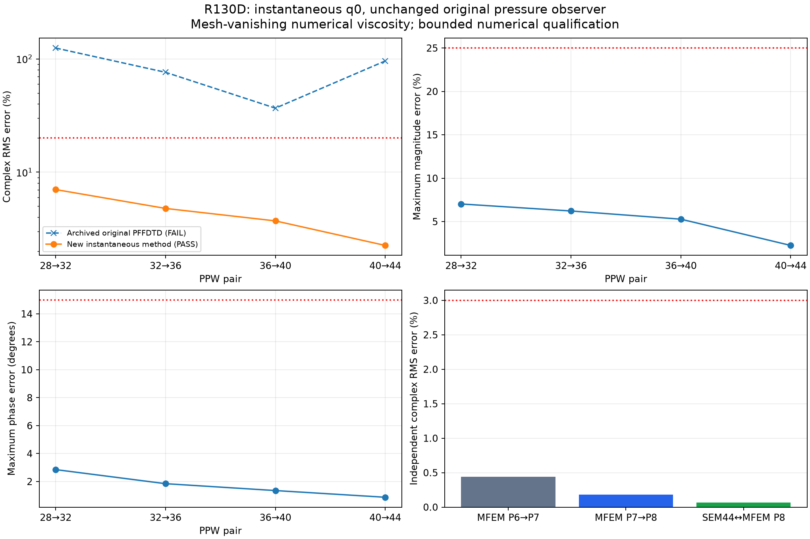

# R130D 瞬間インパルスの収束修正（2026-10-10）

**瞬間入力と元の記録方法を維持する新しい数値解法が、指定された全4組の収束判定と独立解析照合に合格しました。** 判定は `PASS_NEW_VANISHING_VISCOSITY_Q0_NUMERICAL_METHOD` です。前回合格した有限帯域音源の解析も維持しています。

音源をガウス波形に置き換えていません。q[0]=1、後続ゼロ、元の各格子の8点の物理位置・重み、元のdt/Nt、40/80 Hz、圧力の中心差分と端の2次片側差分、全記録の矩形DTFTを維持しました。入力の面積は元のdtで、初期速度の跳躍c²dt M⁻¹bとして伝播します。全50,653〜148,877モードを保持し、モード削除・観測窓・振幅位相の合わせ込みを使っていません。

## 実装した修正

斜面天井に適合する4次SEMに、格子とともにゼロになる数値散逸を加えました。Lを剛壁の正の波動作用素として、

`phi_tt + nu_h L² phi_t + L phi = c² b q`、`nu_h = h³/c³`。

**有限の格子では減衰を加える修正です。** 音源や記録の帯域制限ではありません。各固有モードの因果的な解を厳密に伝播し、元のサンプル時刻でポテンシャルを評価してから、元の圧力差分を適用します。時間刻みによる人工的な振動を重ねない方式です。

モードのエネルギーE=(v²+lambda phi²)/2は `dE/dt=-nu_h lambda² v²≤0`。定数の剛体モードは保持します。固定した物理モードではnu_hがh³で消え、無散逸解との差も3次で減ることを独立な状態行列の指数関数と比較して確認しました。nu_h=0の場合は過去の厳密時間・元記録結果を相対誤差約10⁻¹³で再現します。

## 元の収束判定

基準は複素RMS20%、最大振幅差25%、最大位相差15度、全4組で合格し、3種類の誤差がすべて厳密に減少することです。40 Hzと80 Hzの両方を評価しています。

| PPW | 複素RMS | 最大振幅差 | 最大位相差 | 判定 |
|---|---:|---:|---:|---|
| 28→32 | 7.02394% | 7.03076% | 2.85098° | 合格 |
| 32→36 | 4.78687% | 6.22283% | 1.84363° | 合格 |
| 36→40 | 3.71501% | 5.28007% | 1.35119° | 合格 |
| 40→44 | 2.25593% | 2.25240% | 0.87153° | 合格 |

全4組、全3指標が基準内で、誤差が減少しています。数値散逸係数kappa=0.5/1/2の結果も保存しました。主判定は事前に固定したkappa=1。kappa=0.5は厳密な減少条件で不合格、kappa=2は合格です。

## 独立した有限要素解析

MFEMの固定コミット `d964264cdb9a13e94a201b6c236c7721e0c8765f` をローカルでコンパイルしました。解析的な56 m³の斜面室を四面体で構成し、質量・剛性行列を独立に組み立てています。元の80点の音源・受音点と固定点2点を評価し、同じ重み・同じ数値散逸・同じ瞬間入力・同じ記録を使用しました。

| 独立解析の判定 | 複素RMS | 最大振幅差 | 最大位相差 | 判定 |
|---|---:|---:|---:|---|
| MFEM 7次→8次 | 0.18250% | 0.82798% | 0.07038° | 合格 |
| SEM PPW44 対 MFEM 8次 | 0.06796% | 0.12199% | 0.09389° | 合格 |

上限は事前に固定した3% / 5% / 3度です。独立モデルは6次/7次/8次の全2,197/3,375/4,913モードを保持しています。6次→7次も合格し、7次→8次では3指標すべてがさらに減りました。質量正規化は全モード、固有残差は全モード、直交性は128モードの標本で検証しています。

以前のMFEM P2行列もビット単位で再現しました。途中の3次→4次の振幅差5.54878%と4次→5次の5.30809%の不合格は保存してあります。上限の5%を緩めたり、以前の判定を合格に上書きしたりしていません。追加の高次化計画を保存・コミット・pushした後で6次〜8次を組み立てました。

## 適用範囲

合格は、この新しい数値解法の5格子の自己収束と、同じ演算子を使った独立解析による数値検証です。**有限格子の数値散逸が、理想的な無散逸の点音源・全記録の解と完全に一致することは証明していません。** 固定モードの整合性確認と、点音源を含む無散逸極限の証明は区別します。実室・BRAS・任意CADの検証も今回の合格範囲に含みません。

固定された旧PFFDTDの保存波形は `SELF_CONVERGENCE_FAILED` のままです。今回の修正はその保存波形を書き換えるものではなく、瞬間入力と観測条件を保持した新しい数値ソルバーへの置き換えです。以前の弱観測だけの修正版の不合格も維持しています。

## 実行と成果物

Python 3.12でZIPを展開し、以下を実行します。

```text
python -m pip install -r requirements.txt
python scripts/r130d_instantaneous_cli.py --output-dir results
python verify.py
```

既定はPPW44・kappa1です。出力は瞬間入力q、全モードのポテンシャル、元の差分圧力の実波形、40/80 Hzの伝達関数、数値解法の合格状態と未検証範囲です。CLI内でも実波形のDTFTと厳密なモード和が一致することを検査します。

ZIPには全5格子の完全固有系、計画と数値証拠、独立解析の行列と出所、実行コード、検証テストを同梱します。研究再実行コードとPR: https://github.com/aaw123m/htdt/pull/118 。PRはDraft、Issue #53は開いた状態を維持します。

関連36テストが合格しました。ZIPに同梱した8テストは状態行列の独立な指数関数、剛体・臨界減衰モード、固定モードの3次整合性、実数値に対する全判定の再計算、以前の不合格と新しい合格の保存を検査します。


